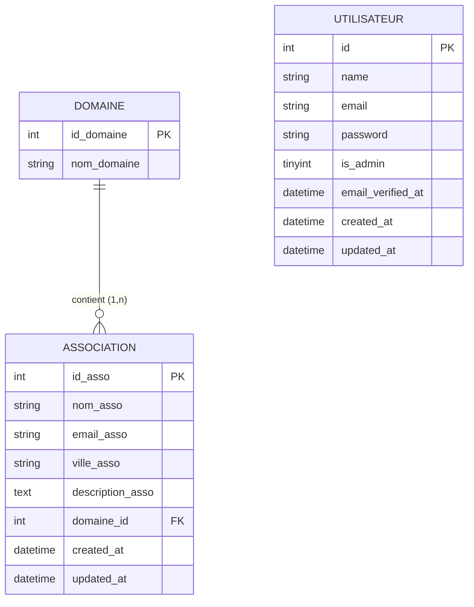

# AssociationsTP — Documentation du projet

> Application web Laravel de gestion d'associations, développée dans le cadre d'un TP.

---

## Table des matières

1. [Présentation](#1-présentation)
2. [Stack technique](#2-stack-technique)
3. [Architecture du projet](#3-architecture-du-projet)
4. [MCD — Modèle Conceptuel de Données](#4-mcd--modèle-conceptuel-de-données)
5. [Base de données](#5-base-de-données)
6. [Modèles & Relations](#6-modèles--relations)
7. [Fonctionnalités](#7-fonctionnalités)
8. [Routes web](#8-routes-web)
9. [API REST](#9-api-rest)
10. [API Explorer](#10-api-explorer)
11. [Authentification & gestion des rôles](#11-authentification--gestion-des-rôles)
12. [Internationalisation](#12-internationalisation)
13. [Formulaire de contact](#13-formulaire-de-contact)
14. [Installation & lancement](#14-installation--lancement)
15. [Récapitulatif technique complet](#15-récapitulatif-technique-complet)

---

## 1. Présentation

**AssociationsTP** est une application web permettant de gérer un annuaire d'associations.  
Chaque association appartient à un domaine (sport, culture, environnement…) et dispose d'un email, d'une ville et d'une description. L'accès à l'application est réservé aux utilisateurs connectés. Une API REST publique permet d'interroger les données depuis du JavaScript, et une page dédiée **API Explorer** affiche les résultats de façon visuelle directement dans l'interface.

---

## 2. Stack technique

| Couche | Technologie | Version |
|---|---|---|
| Langage backend | PHP | ^8.2 |
| Framework backend | Laravel | ^12.0 |
| UI réactive | Livewire + Volt | ^3.6 / ^1.7 |
| Authentification | Laravel Breeze | ^2.3 |
| API tokens | Laravel Sanctum | ^4.0 |
| CSS | Bootstrap 5 + Tailwind CSS | via CDN / Vite |
| Base de données | MySQL | (Laragon) |
| Serveur local | Laragon | PHP 8.3 |
| Tests | Pest | ^4.1 |
| Debug (dev) | Laravel Debugbar | ^3.16 |

---

## 3. Architecture du projet

```
associationsTP/
├── app/
│   ├── Http/
│   │   ├── Controllers/
│   │   │   ├── Api/
│   │   │   │   └── ApiController.php        ← Endpoints API REST (5 routes)
│   │   │   ├── Auth/                         ← Controllers Breeze (login, register…)
│   │   │   ├── AssociationController.php     ← CRUD associations
│   │   │   ├── ContactController.php         ← Formulaire de contact (envoi mail)
│   │   │   ├── DomaineController.php         ← Gestion des domaines
│   │   │   └── ProfileController.php         ← Profil utilisateur
│   │   ├── Middleware/
│   │   │   ├── IsAdmin.php                   ← Bloque les non-admins (403)
│   │   │   └── LocaleMiddleware.php          ← Langue FR/EN par session
│   │   └── Requests/
│   ├── Livewire/                              ← Composants Livewire (auth, logout)
│   ├── Models/
│   │   ├── Association.php                   ← belongsTo Domaine
│   │   ├── Domaine.php                       ← hasMany Associations
│   │   └── User.php
│   └── Providers/
├── database/
│   └── migrations/                           ← Historique structuré des migrations
├── resources/
│   └── views/
│       ├── layouts/
│       │   ├── app.blade.php                 ← Layout principal (Bootstrap 5)
│       │   ├── guest.blade.php
│       │   └── navigation.blade.php          ← Navbar avec lien API Explorer
│       ├── components/                       ← Composants réutilisables
│       ├── auth/                             ← Pages d'authentification
│       ├── api_explorer.blade.php            ← Page API Explorer (fetch JS + tabs)
│       ├── association.blade.php
│       ├── association_detail.blade.php
│       ├── association_add.blade.php
│       ├── association_edit.blade.php
│       ├── domaine_add.blade.php
│       ├── domaine_list.blade.php
│       ├── home.blade.php
│       └── contact.blade.php
├── routes/
│   ├── api.php                               ← 5 routes API REST sous /api/v1
│   ├── web.php                               ← Routes web + /api-explorer
│   └── auth.php                              ← Routes d'authentification
└── public/
    └── js/
        └── api-example.js                    ← Exemple d'utilisation de l'API en JS
```

---

## 4. MCD — Modèle Conceptuel de Données

### Notation Merise

```
                    ┌─────────────────────────────────┐
                    │           UTILISATEUR           │
                    ├─────────────────────────────────┤
                    │ # id                            │
                    │   name                          │
                    │   email                         │
                    │   password                      │
                    │   is_admin                      │
                    │   email_verified_at             │
                    └─────────────────────────────────┘


  ┌───────────────────┐               ┌──────────────────────────────────┐
  │      DOMAINE      │               │           ASSOCIATION            │
  ├───────────────────┤               ├──────────────────────────────────┤
  │ # id_domaine      │               │ # id_asso                        │
  │   nom_domaine     │               │   nom_asso                       │
  └───────────────────┘               │   email_asso                     │
           │                          │   ville_asso                     │
           │ (1,n)                    │   description_asso               │
           │                          └──────────────────────────────────┘
           │                                       │
           └──────────── APPARTENIR ───────────────┘
                  (1,n)             (1,1)
```

**Lecture des cardinalités :**

| Côté | Cardinalité | Signification |
|---|---|---|
| DOMAINE → APPARTENIR | `(1,n)` | Un domaine contient **au moins une** association et peut en avoir **plusieurs** |
| ASSOCIATION → APPARTENIR | `(1,1)` | Une association appartient à **exactement un** domaine |

> `UTILISATEUR` n'a pas de relation directe avec `ASSOCIATION` dans ce modèle — les droits sont gérés par le champ `is_admin`, pas par une liaison en base.

---

### Diagramme entité-relation (Mermaid)



---

## 5. Base de données

**Nom de la base :** `associationstp`  
**Driver :** MySQL (127.0.0.1:3306)

### Schéma

#### Table `domaine`

| Colonne | Type | Contraintes |
|---|---|---|
| `id_domaine` | BIGINT UNSIGNED | PK, AUTO_INCREMENT |
| `nom_domaine` | VARCHAR(255) | NOT NULL |

> Pas de timestamps sur cette table (données de référence).

---

#### Table `associations`

| Colonne | Type | Contraintes |
|---|---|---|
| `id_asso` | BIGINT UNSIGNED | PK, AUTO_INCREMENT |
| `nom_asso` | VARCHAR(255) | NOT NULL |
| `email_asso` | VARCHAR(255) | NULLABLE |
| `ville_asso` | VARCHAR(255) | NULLABLE |
| `description_asso` | TEXT | NULLABLE |
| `domaine_id` | BIGINT UNSIGNED | FK → `domaine.id_domaine` (CASCADE DELETE) |
| `created_at` | TIMESTAMP | — |
| `updated_at` | TIMESTAMP | — |

---

#### Table `users`

| Colonne | Type | Contraintes |
|---|---|---|
| `id` | BIGINT UNSIGNED | PK, AUTO_INCREMENT |
| `name` | VARCHAR(255) | NOT NULL |
| `email` | VARCHAR(255) | NOT NULL, UNIQUE |
| `email_verified_at` | TIMESTAMP | NULLABLE |
| `password` | VARCHAR(255) | NOT NULL (hashé Bcrypt) |
| `is_admin` | BIGINT UNSIGNED | NOT NULL |
| `remember_token` | VARCHAR(100) | NULLABLE |
| `created_at` / `updated_at` | TIMESTAMP | — |

---

#### Autres tables système

| Table | Rôle |
|---|---|
| `cache` / `cache_locks` | Cache Laravel (driver `database`) |
| `jobs` / `job_batches` / `failed_jobs` | File d'attente (driver `database`) |
| `sessions` | Sessions utilisateurs (driver `database`) |
| `personal_access_tokens` | Tokens Sanctum pour l'API |
| `password_reset_tokens` | Réinitialisation de mot de passe |

---

### Diagramme de relations

```
┌────────────┐         ┌─────────────────────┐
│   domaine  │         │     associations     │
│────────────│ 1     N │─────────────────────│
│ id_domaine │◄────────│ domaine_id (FK)      │
│ nom_domaine│         │ id_asso              │
└────────────┘         │ nom_asso             │
                       │ email_asso           │
                       │ ville_asso           │
                       │ description_asso     │
                       └─────────────────────┘
```

---

## 6. Modèles & Relations

### `Domaine`

```php
// app/Models/Domaine.php
protected $table      = 'domaine';
protected $primaryKey = 'id_domaine';
protected $fillable   = ['nom_domaine'];
public $timestamps    = false;

// Relations
public function associations() → hasMany(Association::class, 'domaine_id', 'id_domaine')
```

### `Association`

```php
// app/Models/Association.php
protected $table      = 'associations';
protected $primaryKey = 'id_asso';
protected $fillable   = ['nom_asso', 'email_asso', 'ville_asso', 'description_asso', 'domaine_id'];

// Relations
public function domaine() → belongsTo(Domaine::class, 'domaine_id', 'id_domaine')
```

### `User`

```php
// app/Models/User.php
protected $fillable = ['name', 'email', 'password'];
protected $hidden   = ['password', 'remember_token'];
// Utilise HasFactory, Notifiable
```

---

## 7. Fonctionnalités

| Fonctionnalité | Description |
|---|---|
| **Authentification** | Inscription, connexion, déconnexion, vérification email, réinitialisation de mot de passe (Laravel Breeze) |
| **Gestion des rôles** | Middleware `IsAdmin` : seuls les admins peuvent créer/modifier/supprimer. Double protection route + vue |
| **Liste des associations** | Affichage de toutes les associations avec leur domaine, filtrable via DataTables |
| **Détail d'une association** | Fiche complète d'une association |
| **Création d'association** | Formulaire avec validation (nom, email, ville, description, domaine) — admin uniquement |
| **Modification d'association** | Formulaire pré-rempli, mise à jour en base — admin uniquement |
| **Suppression d'association** | Suppression avec confirmation, cascade sur les FK — admin uniquement |
| **Gestion des domaines** | Liste, création et suppression de domaines (bloquée si des associations y sont liées) — admin uniquement |
| **Profil utilisateur** | Modification du nom/email, changement de mot de passe, suppression du compte |
| **Formulaire de contact** | Envoi d'un email vers l'administrateur via SMTP |
| **Changement de langue** | Bascule FR ↔ EN via session |
| **API REST** | 5 endpoints JSON publics en lecture sous `/api/v1` |
| **API Explorer** | Page web visualisant les résultats de l'API en temps réel (cards + tableau + filtre) |

---

## 8. Routes web

Toutes les routes web sont protégées par `auth` + `LocaleMiddleware`. Les routes d'écriture ajoutent le middleware `IsAdmin`.

**Accessibles à tous les utilisateurs connectés**

| Méthode | URL | Controller | Action |
|---|---|---|---|
| GET | `/` | — | Vue `home` |
| GET | `/home` | — | Vue `home` |
| GET | `/association` | AssociationController | Liste des associations |
| GET | `/association/{id}` | AssociationController | Détail |
| GET | `/contact` | ContactController | Formulaire de contact |
| POST | `/contact` | ContactController | Envoi du mail |
| GET | `/profile` | ProfileController | Édition du profil |
| PATCH | `/profile` | ProfileController | Mise à jour du profil |
| DELETE | `/profile` | ProfileController | Suppression du compte |
| GET | `/lang/{locale}` | — | Changement de langue (fr/en) |
| GET | `/api-explorer` | — | Page API Explorer |

**Réservées aux admins** (`is_admin = 1`) — retourne `403` sinon

| Méthode | URL | Controller | Action |
|---|---|---|---|
| GET | `/association/create` | AssociationController | Formulaire de création |
| POST | `/association` | AssociationController | Enregistrement |
| GET | `/association/{id}/edit` | AssociationController | Formulaire d'édition |
| PUT | `/association/{id}` | AssociationController | Mise à jour |
| DELETE | `/association/{id}` | AssociationController | Suppression |
| GET | `/domaine` | DomaineController | Liste des domaines |
| GET | `/domaine/create` | DomaineController | Formulaire de création domaine |
| POST | `/domaine` | DomaineController | Enregistrement domaine |
| DELETE | `/domaine/{id}` | DomaineController | Suppression domaine |

**Routes d'authentification** (publiques, via `routes/auth.php`) :

| URL | Action |
|---|---|
| `/login` | Connexion |
| `/register` | Inscription |
| `/logout` | Déconnexion |
| `/forgot-password` | Mot de passe oublié |
| `/reset-password` | Réinitialisation |
| `/verify-email` | Vérification d'email |

---

## 9. API REST

L'API est **publique** (lecture seule, pas d'authentification requise).  
Toutes les réponses sont en **JSON** avec les codes HTTP standards (`200`, `404`, `500`).  
**Base URL :** `http://associationstp.test/api/v1`  
**Controller :** `app/Http/Controllers/Api/ApiController.php`

### Endpoints

#### `GET /api/v1/domaines`

Retourne tous les domaines.

```json
[
  { "id_domaine": 1, "nom_domaine": "Sport" },
  { "id_domaine": 2, "nom_domaine": "Culture" }
]
```

---

#### `GET /api/v1/domaines/{id}/associations`

Retourne toutes les associations d'un domaine donné.

```json
{
  "domaine": { "id_domaine": 2, "nom_domaine": "Culture" },
  "associations": [
    {
      "id_asso": 3,
      "nom_asso": "Les Amis du Théâtre",
      "email_asso": "contact@theatre.fr",
      "ville_asso": "Rennes",
      "description_asso": "...",
      "domaine_id": 2
    }
  ]
}
```

---

#### `GET /api/v1/associations`

Retourne toutes les associations avec leur domaine imbriqué (`with('domaine')`).

```json
[
  {
    "id_asso": 1,
    "nom_asso": "Les Coureurs du Dimanche",
    "email_asso": "run@example.com",
    "ville_asso": "Nantes",
    "description_asso": "Club de running",
    "domaine_id": 1,
    "domaine": { "id_domaine": 1, "nom_domaine": "Sport" }
  }
]
```

---

#### `GET /api/v1/associations/{id}`

Retourne le détail d'une association. Renvoie `404` si introuvable.

---

#### `GET /api/v1/emails`

Retourne uniquement les associations ayant un email renseigné (filtre `whereNotNull`).

```json
[
  { "id_asso": 1, "nom_asso": "Les Coureurs du Dimanche", "email_asso": "run@example.com" },
  { "id_asso": 3, "nom_asso": "Les Amis du Théâtre",     "email_asso": "contact@theatre.fr" }
]
```

---

### Utilisation en JavaScript

```js
const API = 'http://associationstp.test/api/v1';

const domaines     = await fetch(`${API}/domaines`).then(r => r.json());
const associations = await fetch(`${API}/associations`).then(r => r.json());
const asso         = await fetch(`${API}/associations/1`).then(r => r.json());
const parDomaine   = await fetch(`${API}/domaines/2/associations`).then(r => r.json());
const emails       = await fetch(`${API}/emails`).then(r => r.json());
```

> Le fichier `public/js/api-example.js` contient ce code prêt à l'emploi.

---

## 10. API Explorer

**URL :** `http://associationstp.test/api-explorer`  
**Vue :** `resources/views/api_explorer.blade.php`  
**Accès :** protégé (utilisateur connecté requis)

Page web qui consomme l'API REST en JavaScript (`fetch`) et affiche les résultats de façon visuelle, sans rechargement de page.

### Fonctionnement

Au chargement de la page, trois appels `fetch` parallèles sont lancés vers l'API. Les résultats s'affichent dans trois onglets Bootstrap.

| Onglet | Endpoint appelé | Affichage |
|---|---|---|
| **Associations** | `GET /api/v1/associations` | Cards Bootstrap (nom, ville, email, badge domaine coloré) |
| **Domaines** | `GET /api/v1/domaines` | Cards avec lien vers les associations du domaine |
| **Emails** | `GET /api/v1/emails` | Tableau avec liens `mailto:` |

### Détails techniques de la page

- **Spinner** affiché pendant chaque appel `fetch`, masqué à la réception des données
- **Badge compteur** dans chaque onglet (ex : `Associations 42`)
- **Filtre en temps réel** : champ de recherche qui filtre les résultats côté client sans rappeler l'API
- **Couleur de badge domaine** : générée de façon déterministe par un hash du nom du domaine (toujours la même couleur pour un domaine donné)
- **Protection XSS** : tous les contenus dynamiques passent par une fonction `escHtml()` avant injection dans le DOM
- **Bouton JSON** sur chaque card association : ouvre l'endpoint `/api/v1/associations/{id}` dans un nouvel onglet

### Navbar

Un lien **API** est présent dans la barre de navigation principale (actif sur la route `api.explorer`).

---

## 11. Authentification & gestion des rôles

L'authentification est gérée par **Laravel Breeze** avec le driver **Livewire + Volt**.

- Sessions stockées en base de données (table `sessions`)
- Tokens API via **Laravel Sanctum** (table `personal_access_tokens`)
- Hachage des mots de passe : Bcrypt (12 rounds)
- Support de la vérification d'email
- Support de la réinitialisation de mot de passe

### Rôles

| Valeur `is_admin` | Rôle | Droits |
|---|---|---|
| `0` | Utilisateur | Lecture seule (liste, détail, contact, profil) |
| `1` | Administrateur | Lecture + écriture (créer, modifier, supprimer associations et domaines) |

Tout nouvel inscrit reçoit automatiquement `is_admin = 0` (valeur par défaut dans le modèle `User`).

### Middleware `IsAdmin`

Fichier : `app/Http/Middleware/IsAdmin.php`

Vérifie que `auth()->user()->is_admin` est vrai. Retourne une réponse `403 Accès réservé aux administrateurs` sinon. Appliqué en couche route **et** les boutons sont masqués dans les vues via `@if(Auth::user()->is_admin)` — double protection.

### Passer un compte en administrateur

```bash
php artisan tinker --execute="App\Models\User::where('email','user@example.com')->update(['is_admin' => 1]);"
```

### Réinitialiser un mot de passe (en local)

```bash
php artisan tinker --execute="App\Models\User::where('email','user@example.com')->update(['password' => bcrypt('nouveau_mdp')]);"
```

---

## 12. Internationalisation

Le projet supporte le **français** (par défaut) et l'**anglais**.

**Mécanisme :**
1. L'utilisateur clique sur un lien de langue → `GET /lang/{locale}`
2. La locale est stockée en session (`session(['locale' => 'fr'])`)
3. Le middleware `LocaleMiddleware` relit la session et applique `app()->setLocale()` à chaque requête

---

## 13. Formulaire de contact

Route : `POST /contact` — Controller : `ContactController@sendMail`

Le formulaire envoie un email brut via `Mail::raw()` :
- **Destinataire :** `mael.kerivel@gmail.com`
- **Expéditeur configuré :** `journee-associations@gmail.com`
- **Sujet :** `Nouveau message Journée des assos : {sujet}`
- **Reply-To :** adresse de l'expéditeur du formulaire
- **SMTP local (dev) :** Mailpit sur `localhost:1025`

Champs validés : `name` (required), `email` (required|email), `subject` (required), `message` (required).

---

## 14. Installation & lancement

### Prérequis

- [Laragon](https://laragon.org/) (PHP 8.3, MySQL, Apache)
- Node.js + npm
- Composer

### Installation

```bash
# 1. Cloner le projet dans laragon/www
git clone <repo> associationsTP
cd associationsTP

# 2. Installation complète (script composer)
composer run setup
# Équivalent à :
#   composer install
#   cp .env.example .env && php artisan key:generate
#   php artisan migrate
#   npm install && npm run build
```

### Configuration `.env`

```env
APP_NAME=Laravel
APP_ENV=local
APP_URL=http://associationstp.test

DB_CONNECTION=mysql
DB_HOST=127.0.0.1
DB_PORT=3306
DB_DATABASE=associationstp
DB_USERNAME=root
DB_PASSWORD=

MAIL_MAILER=smtp
MAIL_HOST=localhost
MAIL_PORT=1025
```

### Lancement en développement

```bash
composer run dev
```

Lance en parallèle :
- `php artisan serve` — serveur PHP
- `npm run dev` — Vite (hot reload)
- `php artisan queue:listen` — file d'attente
- `php artisan pail` — logs en temps réel

### Tests

```bash
composer run test
# ou
php artisan test
```

---

## 15. Récapitulatif technique complet

Tout ce qui a été réalisé sur ce projet, de A à Z.

### Projet de base (Laravel Breeze)

| # | Ce qui a été fait | Fichiers concernés |
|---|---|---|
| 1 | Initialisation d'un projet Laravel 12 avec Breeze (Livewire + Volt) | `composer.json`, `app/`, `routes/` |
| 2 | Configuration de la base MySQL via Laragon | `.env` |
| 3 | Migration de la table `users` avec `is_admin` | `0001_01_01_000000_create_users_table.php`, `2026_01_16_150820_add_is_admin_user.php` |
| 4 | Tables système : cache, sessions, jobs, password_reset_tokens | Migrations `000001`, `000002` |
| 5 | Authentification complète : login, register, logout, profil, reset password, verify email | `app/Http/Controllers/Auth/`, `routes/auth.php`, vues `auth/` |
| 6 | Middleware `LocaleMiddleware` pour la langue FR/EN par session | `app/Http/Middleware/LocaleMiddleware.php` |

---

### Modèle de données métier

| # | Ce qui a été fait | Fichiers concernés |
|---|---|---|
| 7 | Création de la table `domaine` | `2025_12_05_125432_create_domaine.php` |
| 8 | Création de la table `associations` | `2025_11_03_095902_create_associations_table.php` |
| 9 | Ajout de la clé étrangère `domaine_id` sur `associations` avec CASCADE DELETE | `2025_12_05_125853_add_domaine_fk_to_associations_table.php` |
| 10 | Table `personal_access_tokens` pour Sanctum | `2026_03_09_073203_create_personal_access_tokens_table.php` |
| 11 | Modèle `Domaine` : table custom, PK custom, pas de timestamps, relation `hasMany` | `app/Models/Domaine.php` |
| 12 | Modèle `Association` : table custom, PK custom, fillable, relation `belongsTo` | `app/Models/Association.php` |

---

### Fonctionnalités web (CRUD)

| # | Ce qui a été fait | Fichiers concernés |
|---|---|---|
| 13 | CRUD complet des associations (liste, détail, création, édition, suppression) | `AssociationController.php`, vues `association*.blade.php` |
| 14 | Gestion des domaines : liste, création, suppression (protégée si associations liées) | `DomaineController.php`, `domaine_add.blade.php`, `domaine_list.blade.php` |
| 15 | Liste avec DataTables (tri, pagination, recherche côté client) | `association.blade.php` |
| 16 | Formulaire de contact avec envoi de mail | `ContactController.php`, `contact.blade.php` |
| 17 | Page de profil (modifier nom/email, changer mot de passe, supprimer compte) | `ProfileController.php`, `profile/` |
| 18 | Bascule de langue FR/EN dans la navbar | `navigation.blade.php`, `LocaleMiddleware.php` |

### Gestion des rôles

| # | Ce qui a été fait | Fichiers concernés |
|---|---|---|
| 19 | Middleware `IsAdmin` : vérifie `is_admin = 1`, retourne 403 sinon | `app/Http/Middleware/IsAdmin.php` |
| 20 | Séparation des routes : lecture (tous) / écriture (admin) | `routes/web.php` |
| 21 | Masquage des boutons Ajouter / Modifier / Supprimer pour les non-admins | `association.blade.php`, `association_detail.blade.php` |
| 22 | Valeur par défaut `is_admin = 0` sur le modèle User (évite l'erreur SQL à l'inscription) | `app/Models/User.php` |

---

### API REST

| # | Ce qui a été fait | Fichiers concernés |
|---|---|---|
| 19 | Création du dossier `Controllers/Api/` et du `ApiController` dédié | `app/Http/Controllers/Api/ApiController.php` |
| 20 | Endpoint `GET /api/v1/domaines` — tous les domaines | `ApiController@domaines` |
| 21 | Endpoint `GET /api/v1/domaines/{id}/associations` — associations d'un domaine | `ApiController@associationsByDomaine` |
| 22 | Endpoint `GET /api/v1/associations` — toutes les associations avec domaine eager-loadé | `ApiController@associations` |
| 23 | Endpoint `GET /api/v1/associations/{id}` — détail d'une association | `ApiController@association` |
| 24 | Endpoint `GET /api/v1/emails` — emails des associations (filtre `whereNotNull`) | `ApiController@emails` |
| 25 | Enregistrement des 5 routes sous le préfixe `/api/v1` | `routes/api.php` |
| 26 | Ajout de la relation `hasMany` sur `Domaine` (nécessaire pour l'endpoint #21) | `app/Models/Domaine.php` |
| 27 | Fichier d'exemple JS pour consommer l'API | `public/js/api-example.js` |

---

### API Explorer (page visuelle)

| # | Ce qui a été fait | Fichiers concernés |
|---|---|---|
| 28 | Vue `api_explorer.blade.php` avec 3 onglets Bootstrap | `resources/views/api_explorer.blade.php` |
| 29 | Chargement des données via `fetch()` au démarrage de la page (3 appels parallèles) | `api_explorer.blade.php` — JS |
| 30 | Onglet Associations : affichage en cards avec badge domaine coloré, ville, email, bouton JSON | `api_explorer.blade.php` |
| 31 | Onglet Domaines : cards avec lien vers l'endpoint `/domaines/{id}/associations` | `api_explorer.blade.php` |
| 32 | Onglet Emails : tableau avec liens `mailto:` | `api_explorer.blade.php` |
| 33 | Spinner de chargement + message d'erreur sur chaque onglet | `api_explorer.blade.php` |
| 34 | Badge compteur dans chaque onglet | `api_explorer.blade.php` |
| 35 | Filtre en temps réel (côté client, sans rappel API) sur chaque onglet | `api_explorer.blade.php` |
| 36 | Fonction `escHtml()` pour protéger tous les contenus dynamiques contre le XSS | `api_explorer.blade.php` |
| 37 | Couleur de badge déterministe par hash du nom du domaine | `api_explorer.blade.php` |
| 38 | Route `GET /api-explorer` ajoutée dans le groupe auth | `routes/web.php` |
| 39 | Lien **API** dans la navbar principale (actif sur la route `api.explorer`) | `resources/views/layouts/navigation.blade.php` |

---

*Documentation mise à jour le 11 mai 2026 — v4 (gestion complète des domaines : liste + suppression).*
